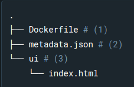
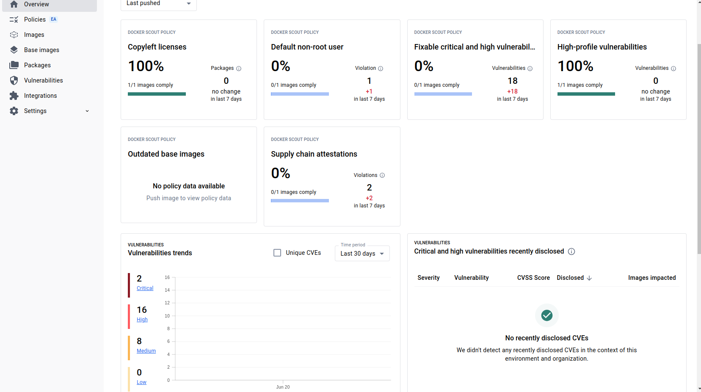
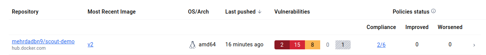

### dockerd = docker deamon

### docker compose up --build --> make sure dockerfiles are build

```docker

ADD	        Add local or remote files and directories.
ARG	        Use build-time variables.
CMD	        Specify default commands.
COPY	    Copy files and directories.
ENTRYPOINT	Specify default executable.
ENV	        Set environment variables.
EXPOSE  	Describe which ports your application is listening on.
FROM	    Create a new build stage from a base image.
HEALTHCHECK	Check a container's health on startup.
LABEL	    Add metadata to an image.
MAINTAINER	Specify the author of an image.
ONBUILD	    Specify instructions for when the image is used in a build.--> ONBUILD is used to add triggers to the build process of a base image, to be executed in child images.
RUN	        Execute build commands.
SHELL	    Set the default shell of an image.
STOPSIGNAL	Specify the system call signal for exiting a container.
USER	    Set user and group ID.
VOLUME	    Create volume mounts.
WORKDIR	    Change working directory.

```

```docker
Most users will want to set this parser directive to docker/dockerfile:1, which causes BuildKit to pull the latest stable version of the Dockerfile syntax before the build.


# syntax=docker/dockerfile:1

Custom Dockerfile implementations allow you to:

    Automatically get bugfixes without updating the Docker daemon
    Make sure all users are using the same implementation to build your Dockerfile
    Use the latest features without updating the Docker daemon
    Try out new features or third-party features before they are integrated in the Docker daemon
    Use alternative build definitions, or create your own

```

```
{
  "bip": "172.100.0.1/24",
  "data-root": "/mnt/data",
  "log-driver": "json-file",
  "log-level": "info",
  "log-opts": {
    "cache-max-size": "20m",
    "cache-compress": "true",
    "max-file": "5",
    "max-size": "10m"
  }
}
```

making extension:

structure of extension




part 3 would be HTML and CSS files
metadata config eg:

```
{
  "ui": {
    "dashboard-tab": {
      "title": "Minimal frontend",
      "root": "/ui",
      "src": "index.html"
    }
  }
}
```
docker run --init?
the --init option in Docker provides a lightweight solution to handle the proper reaping of child processes when the container exits, especially when the main process in the container is not well-designed to handle this itself

for multi service container(more than one process in container):
https://docs.docker.com/config/containers/multi-service_container/

**Live restore during upgrades**
Live restore allows you to keep containers running across Docker daemon updates, but is only supported when installing patch releases (YY.MM.x), not for major (YY.MM) daemon upgrades.

## docker scout

```
docker scout enroll mehrdadbn9
docker scout repo enable --org mehrdadbn9 mehrdadbn9/scout-demo
docker scout cves --only-package express
```





Two types of build annotations are available:

Software Bill of Material (SBOM): list of software artifacts that an image contains, or that were used to build the image.
Provenance: how an image was built.

```
docker build --push --tag <org>/<image:tag> --provenance=true --sbom=true .
docker buildx build --sbom=true --provenance=true .
```
