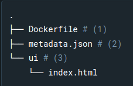

making extension:

structure of extension

part 3 would be HTML and CSS files
metadata config eg:
{
  "ui": {
    "dashboard-tab": {
      "title": "Minimal frontend",
      "root": "/ui",
      "src": "index.html"
    }
  }
}

``

